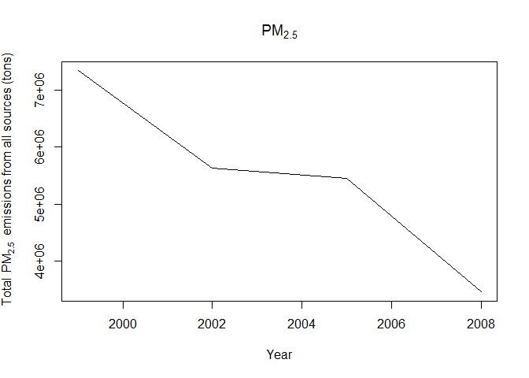
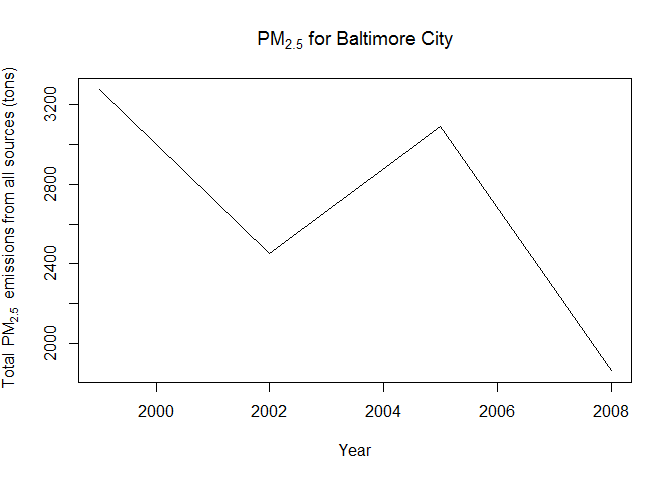
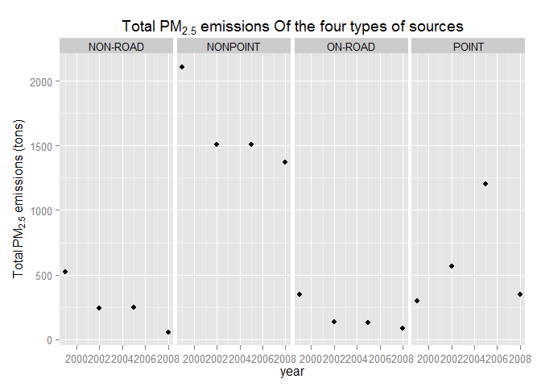
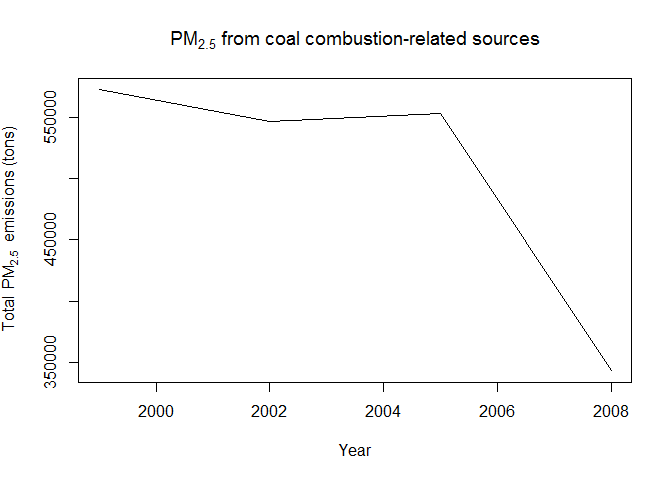
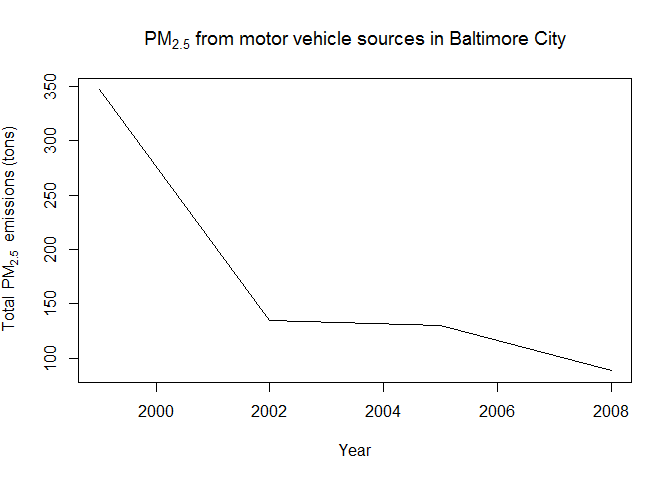
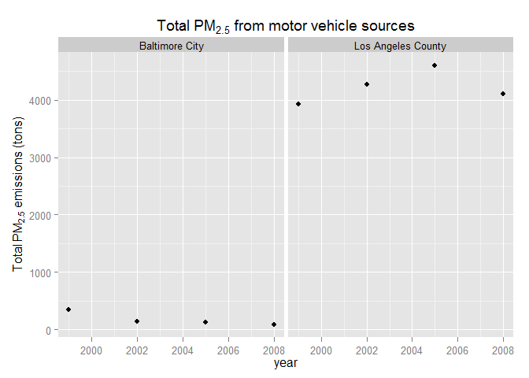

# ExData_PeerAssessment2
qingcheng  
Thursday, August 21, 2014  


This document records the analysis process and result for Course Project 2 of [Exploratory Data Analysis][1] course in Coursera. 


## A. Environment and Information
> * The encoding of the script is CP936
> * R version 3.1.1 (2014-07-10) -- "Sock it to Me"
> * Platform: i386-w64-mingw32/i386 (32-bit)
> * Operating system: Windows 7 (SP1)
> * 20140821 qingcheng
> * Couresra-[Exploratory Data Analysis][exdata-005][Course Project 2]

The overall goal of this assignment is to explore the National Emissions
Inventory database and see what it say about fine particulate matter 
pollution in the United states over the 10-year period 1999–2008.


## B. Download and UnZip the dataset (29MB)

```r
DataUrl <- "https://d396qusza40orc.cloudfront.net/exdata%2Fdata%2FNEI_data.zip"
DataInfoUrl <- "http://www.epa.gov/ttn/chief/eiinformation.html"

# download.file(DataUrl, "exdata-data-NEI_data.zip", mode = "wb")
# dateDownloaded <- date()
# dateDownloaded
# [1] "Thu Aug 21 14:39:28 2014"

# unzip("exdata-data-NEI_data.zip")
```


## C. Question 1
Have total emissions from PM2.5 decreased in the United States from 1999 to 
2008? Using the base plotting system, make a plot showing the total PM2.5 
emission from all sources for each of the years 1999, 2002, 2005, and 2008.

```r
# read dataset, this first line will likely take a few seconds. Be patient!
NEI <- readRDS("summarySCC_PM25.rds")
SCC <- readRDS("Source_Classification_Code.rds")

s <- tapply(NEI$Emissions, NEI$year, sum)

# png("plot1.png", width=480, height=480)
plot(names(s), s, xlab="Year", type="l", main=expression(PM[2.5]),
     ylab=expression("Total " ~ PM[2.5] ~ " emissions from all sources (tons)"))
```

 

```r
# dev.off()
```


## D. Question 2
Have total emissions from PM2.5 decreased in the Baltimore City, Maryland 
(fips == "24510") from 1999 to 2008? Use the base plotting system to make 
a plot answering this question.

```r
BaltimoreCity <- subset(NEI, fips == "24510")
s = aggregate(BaltimoreCity$Emissions ~ BaltimoreCity$year, FUN=sum)
names(s) <- c("year","totalEmissions")

# png("plot2.png", width=480, height=480)
plot(s$year, s$totalEmissions, type="l",
     main=expression(PM[2.5] ~ "for Baltimore City"), xlab="Year",
     ylab=expression("Total " ~ PM[2.5] ~ " emissions from all sources (tons)"))
```

 

```r
# dev.off()
```


## E. Question 3
Of the four types of sources indicated by the type (point, nonpoint, onroad, 
nonroad) variable, which of these four sources have seen decreases in 
emissions from 1999–2008 for Baltimore City? Which have seen increases in 
emissions from 1999–2008? Use the ggplot2 plotting system to make a plot 
answer this question.

```r
library(ggplot2)

BaltimoreCity <- subset(NEI, fips == "24510")
s = aggregate(BaltimoreCity$Emissions ~ BaltimoreCity$year + 
                  BaltimoreCity$type, FUN=sum)
names(s) <- c("year", "type", "totalEmissions")

# png("plot3.png", width=600, height=300)
qplot(year,totalEmissions,data=s,facets=.~type)+  
    ggtitle(expression("Total" ~ PM[2.5] ~
                           "emissions Of the four types of sources")) + 
    ylab(expression("Total" ~ PM[2.5] ~ "emissions (tons)"))
```

 

```r
# dev.off()
```


## F. Question 4
Across the United States, how have emissions from coal combustion-related 
sources changed from 1999–2008?

```r
SCC_Coal=SCC[grepl("coal", SCC$EI.Sector, ignore.case=TRUE),]
CoalCombustion <- subset(NEI, SCC %in% SCC_Coal$SCC)
s <- tapply(CoalCombustion$Emissions, CoalCombustion$year, sum)

# png("plot4.png", width=480, height=480)
plot(names(s), s, xlab="Year", type="l", 
     main=expression(PM[2.5]~"from coal combustion-related sources"),
     ylab=expression("Total " ~ PM[2.5] ~ " emissions (tons)"))
```

 

```r
# dev.off()
```


## G. Question 5
How have emissions from motor vehicle sources changed from 1999–2008 in
Baltimore City?

```r
BaltimoreCityMotor <- subset(NEI, fips == "24510" & type == "ON-ROAD")
s <- tapply(BaltimoreCityMotor$Emissions, BaltimoreCityMotor$year, sum)

# png("plot5.png", width=480, height=480)
plot(names(s), s, xlab="Year", type="l", 
     main=expression(PM[2.5]~"from motor vehicle sources in Baltimore City"),
     ylab=expression("Total " ~ PM[2.5] ~ " emissions (tons)"))
```

 

```r
# dev.off()
```


## H. Question 6
Compare emissions from motor vehicle sources in Baltimore City with emissions 
from motor vehicle sources in Los Angeles County, California (fips == "06037"). 
Which city has seen greater changes over time in motor vehicle emissions?

```r
CityMotor <- subset(NEI, (fips %in% c("24510","06037")) & type == "ON-ROAD")
s = aggregate(CityMotor$Emissions ~ CityMotor$year + CityMotor$fips, FUN=sum)
names(s) <- c("year","fips","totalEmissions")
s <- transform(s,region = ifelse(fips == "24510", 
                                 "Baltimore City", "Los Angeles County"))

# png("plot6.png", width=600, height=400)
qplot(year,totalEmissions,data=s,facets=.~region) +  
    ggtitle(expression("Total" ~ PM[2.5] ~"from motor vehicle sources")) + 
    ylab(expression("Total" ~ PM[2.5] ~ "emissions (tons)"))
```

 

```r
# dev.off()
```


[1]:https://class.coursera.org/exdata-005
